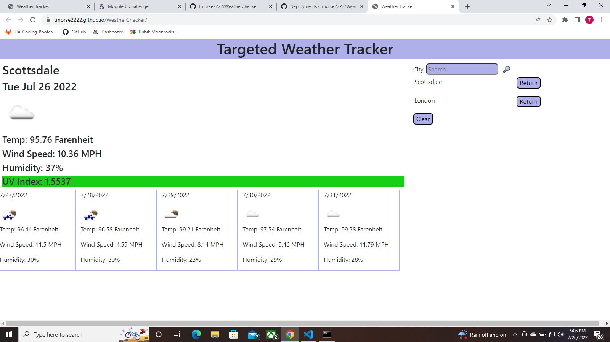

Tyler Morse 
Challenge 5: Work Day Scheduler 
Start Date: 07/22/22 
Most Recent Edit: 07/27/22 

 
User Story: 
AS A traveler 
I WANT to see the weather outlook for multiple cities 
SO THAT I can plan a trip accordingly 
 
Acceptance Criteria: 
GIVEN a weather dashboard with form inputs 
WHEN I search for a city 
THEN I am presented with current and future conditions for that city and that city is added to the search history 
WHEN I view current weather conditions for that city 
THEN I am presented with the city name, the date, an icon representation of weather conditions, the temperature, the humidity, the wind speed, and the UV index 
WHEN I view the UV index 
THEN I am presented with a color that indicates whether the conditions are favorable, moderate, or severe 
WHEN I view future weather conditions for that city 
THEN I am presented with a 5-day forecast that displays the date, an icon representation of weather conditions, the temperature, the wind speed, and the humidity 
WHEN I click on a city in the search history 
THEN I am again presented with current and future conditions for that city 
 
This challenge tasked us with creating a weather application that is capable of retrieving data from third-party servers. All documents were coded from scratch, featuring the use of bootstrap and custom css for styling and use of Jquery and custom JS to achieve functionality. The application pulls from 4 different server-side APIs; Geocoding, Current weather, and 5 day forcast from openweathermap.org, and UV info from openuv.io.

A link to the deployed application can be found <a href="https://tmorse2222.github.io/WeatherChecker/">here</a>